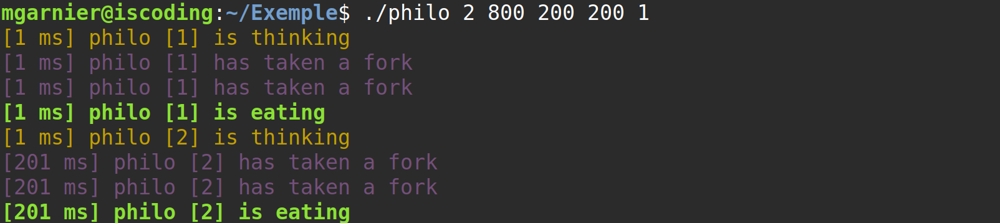

*This project has been created as part of the 42 curriculum by mgarnier.*

# <h1 align="center">📖​PHILOSOPHERS🍝</h1>

## 1️⃣​Description

The purpose of this project is to manage multiple threads who will use the same informations. The use of the tool mutex is necessary to success.

## 2️⃣​Instructions

`make`

`./philo [nb_of_philosophers] [time_to_die] [time_to_eat] [time_to_sleep] [optional_number_of_times_each_philosopher_must_eat]`

Exemple:

## 3️⃣​Resources

I used this [website](https://www.codequoi.com/threads-mutex-et-programmation-concurrente-en-c/#attention-aux-deadlock) to better understand thread and mutex.

I asked Chatgpt for exercices on these new concepts and practiced by writting small programs.

I developed my own testing script using Bash.